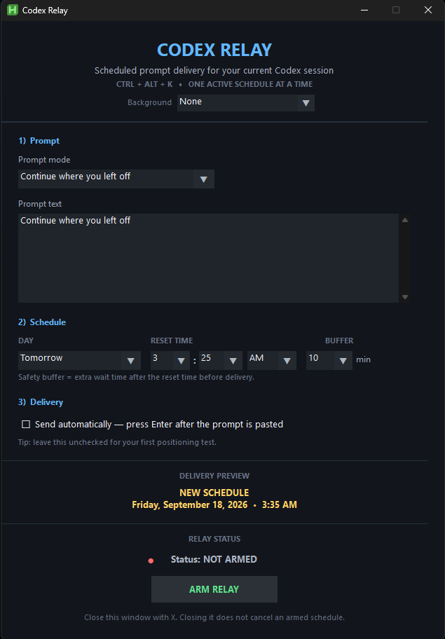
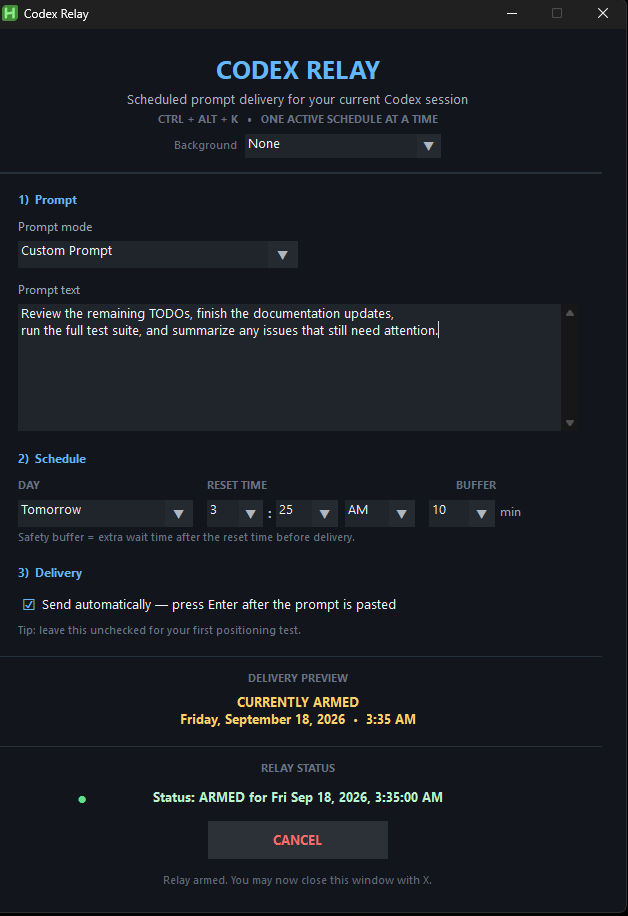
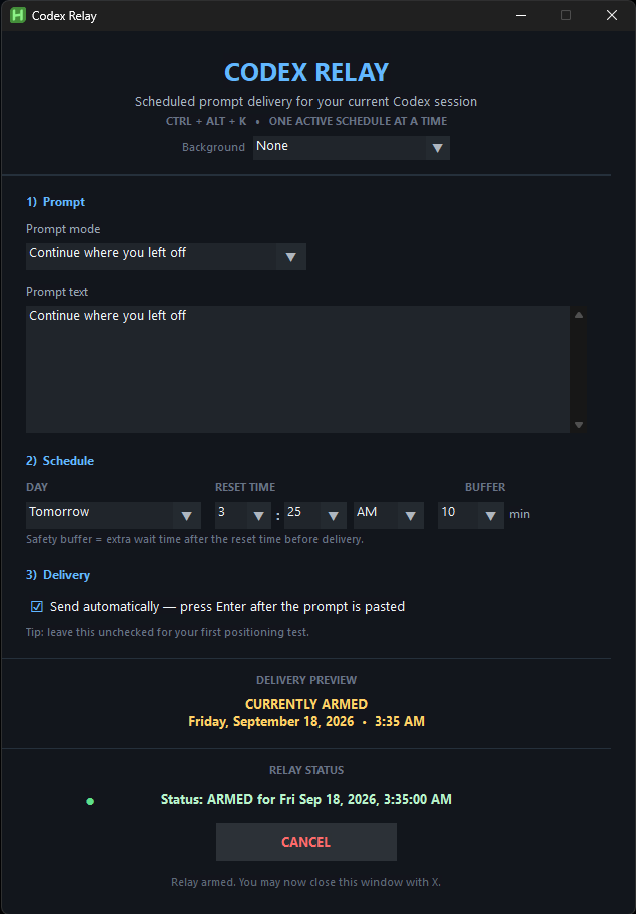
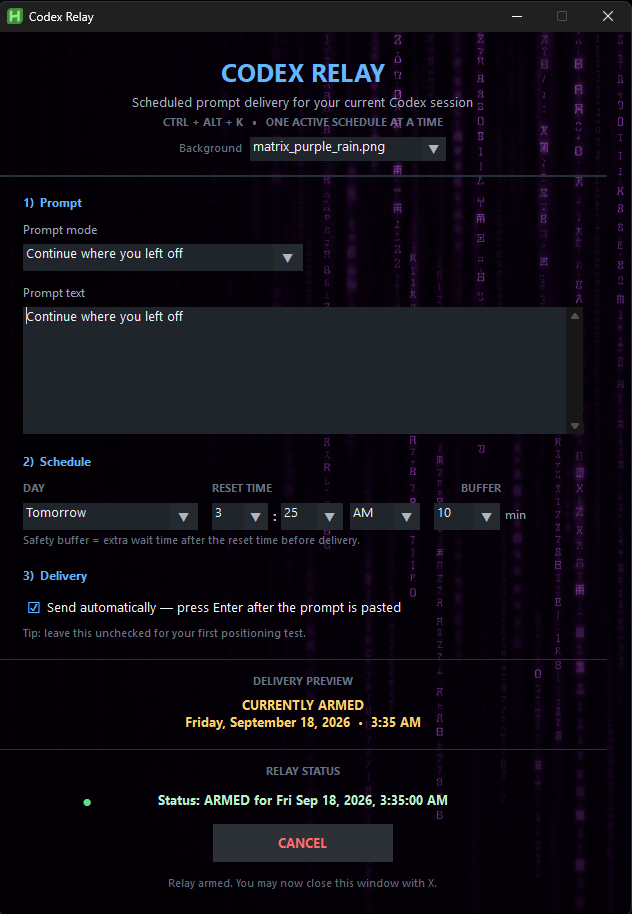

# Codex Relay

Codex Relay is a small AutoHotkey v2 utility for scheduling a prompt to be delivered to the ChatGPT desktop app for Codex workflows at a later time.

It was built for a simple problem: Codex usage can reset hours or days after work stops, and you may already know exactly what you want to send next. Codex Relay lets you prepare that prompt in advance, choose when it should run, and let the computer handle the waiting.

Codex Relay is intentionally **not** an autonomous coding agent. It does not decide what Codex should do, inspect your project, or guess whether unfinished work should continue. You choose the prompt, the time, and whether Enter should be pressed.

## Screenshots

### Default interface



### Custom prompt



### Armed relay



### Optional background



## Features

- Schedule one Codex prompt at a time
- Built-in **Continue where you left off** prompt
- Custom multiline prompts
- Choose the day and reset time
- Add a configurable safety buffer after a usage reset
- Optional **Send automatically** setting that presses Enter after the prompt is pasted
- Keeps the scheduler window open after arming so you can visually confirm the active schedule
- Automatically focuses the ChatGPT desktop app before interacting with Codex
- Saves scheduled prompts as local Markdown files
- Uses unique prompt filenames containing both creation time and scheduled time
- Saves active schedule state locally
- Restores a future schedule after Codex Relay is restarted
- Detects a schedule that was missed while Codex Relay was not running
- Never automatically sends a missed prompt late
- Optional local background images with a built-in **None** mode
- Custom dark UI and themed selectors
- Keeps local prompt files and schedule state out of Git through `.gitignore`

## Why it exists

A common Codex workflow looks something like this:

1. Codex is working on a task.
2. Usage runs out and the next reset is several hours away.
3. You already know the next prompt you want to send, but you may be asleep or away from the computer when usage resets.
4. You schedule the prompt in Codex Relay and leave the ChatGPT desktop app open on the correct Codex conversation.
5. At the scheduled time, Codex Relay brings ChatGPT to the front, places the prompt in the Codex input box, and optionally presses Enter.

The same idea can also be useful for weekly usage resets or for a planned custom prompt several days in the future.


### Using files, images, or other attachments

Codex Relay schedules and delivers **text prompts**. It does not attach files, images, or other documents for you.

If your next Codex prompt depends on attachments, the simplest workflow is to add those files or images to the target ChatGPT/Codex conversation **before** arming Codex Relay. Leave the correct conversation open, then schedule the follow-up text prompt normally.

This keeps attachment handling manual and visible while Codex Relay handles only the delayed text delivery. Contributors are welcome to experiment with attachment automation in forks or future pull requests, but it is intentionally outside the current scope of the official utility.

## What Codex Relay does not do

Codex Relay deliberately keeps automation limited.

It does **not**:

- Decide whether Codex finished a task
- Detect usage limits automatically
- Use computer vision or OCR to inspect Codex
- Decide what prompt should be sent
- Navigate to a project or conversation for you
- Open the correct Codex workspace automatically
- Queue a chain of prompts
- Attach files, images, or documents automatically
- Automatically retry a missed schedule

The goal is assisted automation: **you make the decisions; Codex Relay handles the waiting and delivery.**

## Requirements

- Windows
- [AutoHotkey v2](https://www.autohotkey.com/)
- ChatGPT desktop app
- A Codex conversation/project already open and ready to receive the scheduled prompt

## Installation

1. Download or clone this repository.
2. Install AutoHotkey v2 if it is not already installed.
3. Run `CodexRelay.ahk`.
4. Press `Ctrl + Alt + K` to open the scheduler.

The `Scheduled Prompts` and `images` folders are created automatically when needed.

## Basic usage

Press:

```text
Ctrl + Alt + K
```

to open Codex Relay.

### Continue an interrupted task

1. Leave **Continue where you left off** selected.
2. Choose the day and the time Codex says your usage resets.
3. Choose a safety buffer.
4. Enable **Send automatically — press Enter after the prompt is pasted** if you want the prompt submitted automatically.
5. Click **Arm Relay**.
6. Confirm the yellow **CURRENTLY ARMED** preview and green relay-status line.
7. You may then close the scheduler window. Closing the window does not cancel the armed schedule.

### What the safety buffer does

The safety buffer delays delivery for a few extra minutes after the reset time you enter. It exists so Codex Relay does not try to send the prompt at the exact instant a usage reset is expected to occur.

For example:

```text
Usage reset time: 6:00 PM
Safety buffer:    10 minutes
Prompt fires at:  6:10 PM
```

The current default is **10 minutes**. You can choose a different buffer or set it to `0` if you want the prompt to fire at the exact scheduled time.

### Schedule a custom prompt

1. Choose **Custom Prompt** from the prompt dropdown, or simply begin editing the built-in prompt text. Editing the built-in prompt automatically switches the mode to **Custom Prompt**.
2. Type or paste your prompt into the multiline prompt box.
3. Choose the day, reset time, and safety buffer.
4. Decide whether Codex Relay should only paste the prompt or also press Enter.
5. Click **Arm Relay**.

Only one schedule is active at a time. While a relay is armed, **Arm Relay** is replaced by **Cancel**. Cancel the active relay before creating a replacement schedule.

After a prompt is delivered successfully, Codex Relay returns the composer to the built-in **Continue where you left off** prompt and disables **Send automatically** so the next schedule starts from a clean state.

## Optional backgrounds

Codex Relay supports local background images as an optional visual customization feature.

The clean dark interface is the default. Every launch begins with:

```text
Background: None
```

To use a custom background:

1. Place an image in the local `images` folder next to `CodexRelay.ahk`.
2. Restart Codex Relay so the folder is scanned again.
3. Open the scheduler with `Ctrl + Alt + K`.
4. Choose the image from the **Background** dropdown.

Supported image types currently include:

- PNG
- JPG / JPEG
- BMP
- GIF

Backgrounds are stretched to fit the fixed scheduler window. Dark, low-contrast images generally work best because the interface text remains readable over them.

The image selector is optional. Choosing **None** returns Codex Relay to the standard dark background.

### Background asset security and provenance

Codex Relay does not download background images from the internet and does not update them automatically. Backgrounds are loaded only from the local `images` folder.

Official bundled background assets, when included, are static images created specifically for this project using ChatGPT image generation and local editing rather than downloaded from random third-party websites.

Security-conscious users can simply leave **Background: None**, remove the `images` folder, or remove any bundled images they do not want to use.

For contributions, binary image changes should be reviewed separately from code changes before they are accepted into the official repository.

## Scheduled prompt files

When a prompt is armed, Codex Relay saves it as a Markdown file in:

```text
Scheduled Prompts\
```

Prompt filenames include the time the prompt was created and the time it is scheduled to run, for example:

```text
created_2026-09-15_23-06-49__scheduled_2026-09-16_04-16-00.md
```

This gives each scheduled prompt a unique file and provides a simple local history of what was prepared.

These Markdown files are ignored by Git by default so personal or project-specific prompts are not accidentally committed to the repository.

## Persistence

Codex Relay stores the active schedule in a local `schedule.ini` file.

If Codex Relay is closed and reopened **before** the scheduled time, the future schedule is restored automatically.

If Codex Relay is reopened **after** the scheduled time has already passed, it marks the schedule as missed and does **not** send the prompt late.

This is an intentional safety behavior.

The local `schedule.ini` file is ignored by Git.

## Starting with Windows

Persistence only works after the script is running again.

If you want Codex Relay to restore schedules automatically after signing in to Windows, you can place a shortcut to `CodexRelay.ahk` in the Windows Startup folder.

Open the Startup folder with:

```text
Win + R
shell:startup
```

Then place a shortcut to `CodexRelay.ahk` there.

**Windows startup behavior is still awaiting final release testing.** Test this on your own system before relying on it for an important schedule.

## Canceling a schedule

When a relay is armed, the centered **Arm Relay** button is replaced by **Cancel**.

Canceling clears the armed state so the schedule will not be restored the next time Codex Relay starts. The prompt text and **Send automatically** choice are intentionally preserved after cancellation so you can correct the schedule or prompt and re-arm it without retyping everything.

## Display and click-position compatibility

Codex Relay does **not** target a specific numbered monitor and it is not hard-coded for a four-monitor desktop.

Before inserting a prompt, the script activates the ChatGPT desktop window and then uses **client-area coordinates relative to that ChatGPT window**. The current code uses:

```ahk
clickX := 390
clickY := clientH - 80
```

Because these coordinates are relative to the active ChatGPT window, the absolute position of that window on the Windows desktop usually does not matter.

### Tested display behavior

The current build has been tested successfully with:

- ChatGPT/Codex on a 1080p landscape monitor
- ChatGPT/Codex moved to a separate 4K landscape monitor
- A four-monitor Windows desktop
- ChatGPT initially unfocused before the scheduled prompt fires

In those tests, Codex Relay correctly focused the ChatGPT desktop app and pasted the prompt into the Codex input box without changing the click-position code.

This means a single-monitor setup, multi-monitor setup, or moving ChatGPT from one landscape monitor to another does **not** inherently require changing the coordinates.

**Portrait-oriented displays have not yet been tested.** Because a portrait window can substantially change the layout and aspect ratio inside ChatGPT, the current click position may miss the Codex prompt box. If you normally leave ChatGPT on a portrait monitor, test the script with automatic sending disabled first and use Window Spy to calibrate the click position if necessary.

A different resolution by itself is not automatically a problem, but window dimensions, display scaling, sidebar width, portrait orientation, and future ChatGPT UI changes can all affect where the Codex prompt box appears inside the window.

### Verify or adjust the click position with Window Spy

AutoHotkey includes **Window Spy**, which can show the mouse position relative to the active application's client area.

1. Open the ChatGPT desktop app and navigate to the Codex conversation you intend to use.
2. Put the ChatGPT window in the size and layout you normally use.
3. Open **Window Spy** from AutoHotkey.
4. Move the mouse over the Codex prompt input box.
5. In Window Spy, look at the **Client** mouse coordinates.
6. Compare those values with the click-position section in `CodexRelay.ahk`.

The current horizontal coordinate is:

```ahk
clickX := 390
```

The vertical coordinate is intentionally measured from the bottom of the ChatGPT client area:

```ahk
clickY := clientH - 80
```

That means Codex Relay clicks 390 client pixels from the left side of the ChatGPT window and 80 client pixels above the bottom.

If your prompt box is elsewhere, adjust these values and run a test with **Send automatically** disabled. Confirm that Codex Relay focuses ChatGPT and pastes into the correct prompt box before enabling unattended sending.

For a different horizontal location, change `390` to the Client X coordinate that lands safely inside your prompt box. For vertical adjustment, change `80` to the distance from the bottom of the ChatGPT client area that lands inside your prompt box.

## Safety behavior

Codex Relay includes several intentionally conservative behaviors:

- ChatGPT must already be running.
- ChatGPT must successfully become the active window before the prompt is inserted.
- Focus is checked again before Enter is pressed.
- A missed schedule is not sent late.
- Only one prompt can be scheduled at a time.
- Prompt text is saved locally before the timer is armed.
- You can test positioning with **Send automatically** disabled before allowing automatic submission.
- Background images are local-only and optional.

## Current limitations

Codex Relay currently interacts with the ChatGPT desktop app using a tested window-relative click position for the Codex prompt box.

A major ChatGPT UI change, significantly different window layout, unusual display scaling, portrait-oriented display, or other layout difference may require adjusting the click position in `CodexRelay.ahk` using Window Spy as described above.

The script also assumes the correct Codex conversation/project is already open. It does not navigate between projects or conversations.

The background system is visual only and intentionally simple. Codex Relay does not include an image editor or download backgrounds from external sources.

## Project status

Codex Relay is currently being prepared for its first public release.

The core workflow has been tested for:

- Scheduled prompt delivery
- Automatic Enter / send behavior
- Custom prompt files
- Schedule restoration after restarting the script
- Canceling an armed schedule
- Safe handling of a missed schedule
- Multi-monitor use on a four-monitor desktop
- Moving ChatGPT/Codex from a 1080p landscape monitor to a 4K landscape monitor
- Optional local background selection
- Clean fallback to the standard dark UI with **Background: None**
- Prompt-mode switching when the built-in prompt is manually edited
- Clean post-delivery reset to the default prompt and disabled automatic sending
- Cancellation that preserves the prepared prompt for quick correction and re-arming

Portrait-monitor behavior has not yet been tested.

Windows startup behavior is the remaining system-level test before the first public release. Once that test is complete, this section should be updated for the release build.

## Contributing

Pull requests and bug reports are welcome.

If you contribute code, keep Codex Relay's core design goal in mind: the user chooses the prompt, timing, and send behavior; the utility should not make autonomous decisions on the user's behalf.

Please call out any pull request that changes binary assets such as PNG or JPG files so those files can be reviewed separately from source-code changes.

## Disclaimer

Codex Relay is an independent utility and is not affiliated with or endorsed by OpenAI.

Use scheduled prompts carefully, especially when working on important codebases. Review and test the workflow on your own system before relying on unattended execution.
